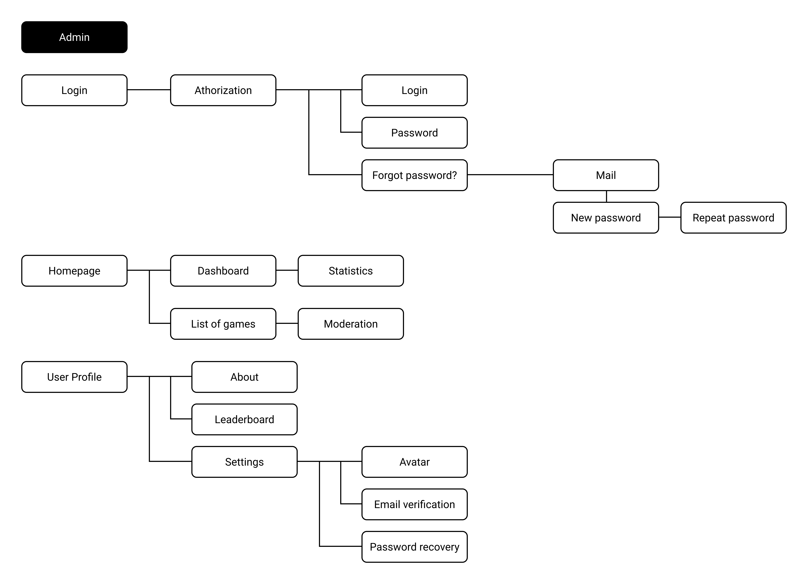
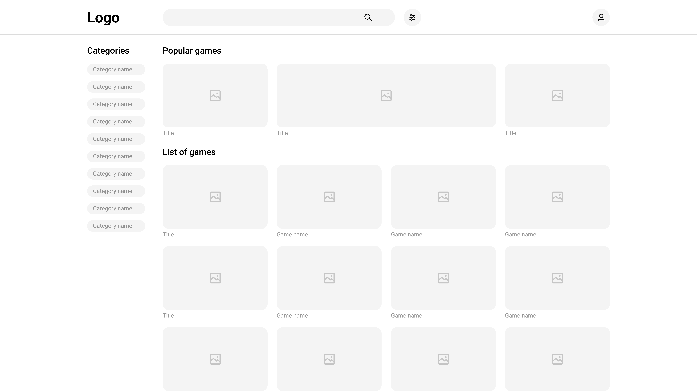

# CSS 410 Research tools and methods
## Team members
+ **Bekzat Yernat** (180107265) - Frontend Developer (GitHub account: PolyAtomicIon)
+ **Altazhanov Abylay** (180107239) - Frontend Developer (GitHub account : altajanovabylay)
+ **Bekmaganbetov Zhanbolat** (180107180) - Backend Developer and PM (Github 180107180)
+ **Aimzhan Sytdykova** (180107110) - UX/UI designer (GitHub account: Ayymzhan)
+ **Yerlan Negmetulla** (180107219) - Backend Developer (GitHub account: yerlan2)

## Project
This project is Web platform for HTML5 games. The platform allows to play games instantly free of charge, submit HTML5 games and monetize them.  

## Alternatives / Market research
Few HTML5 games distribution platforms are **Mozilla Marketplace, Facebook, Gamee, Yandex.Games, MarketJS, BoosterMedia, Kongregate, CrazyGames, Softgames, itch.io.**

## Goals
* ### What is the purpose of this project?
    Our goal is to create the best conditions for developers to host their games, reach an audience of gamers and users to discover new ways of instantly playing in the browser.

* ### What are the problems it will solve?
    * Nowadays, the monopoly of app markets, such as google play and app stores limit game developers and require high commissions. To address this issue, we will work on an open platform for independent game developers with a focus on HTML5 games.
    * Users with low-end devices lack enough storage on their devices and can not access games from markets, the only way is to play online, and our platform provides a list of high-quality games that could be played instantly free of charge. 
    * We offer integration for messengers to increase customer acquisition and retention by creating conditions for competition. 

* ### What is the product vision?
    Entertainment in the twenty-first century should be available without the need for downloads, installations, or specific equipment. No matter what device you use, you can play anywhere, at any time! And we will provide high-quality, lightweight, fun games to users.
    For developers, we will provide tools to create leaderboards, monetize games, reach the audience of players and get feedback on their games. 

## Technologies
In our project we use **HTML5**, **VueJS**, **Node Js**, **Django**

## Pages / Activities 
We will have following pages:
- List of games grouped by tags, genres, popularity
- Category page with list of games game in specific category
- Game page with details, feedback, actual game, leaderboards
- Developers dashboard for managing games
- Profile page with list of last played games, leaderboards
- Authorization page
- Settings page
- Landing page about our platform
- Admin panel for managing games, developers in the platform

## User Personas

### Student
<table>
    <tr>
        <td>
            User Type
        </td>
        <td>
            Website User (External)
        </td>
    </tr>
    <tr>
        <td>
            Occupation
        </td>
        <td>
            Computer Science Student
        </td>
    </tr>
    <tr>
        <td>
        Name
        </td>
        <td>
        Arman Kuandyq
        </td>
    </tr>
    <tr>
        <td>Gender
        </td>
        <td>Male
        </td>
    </tr>
    <tr>
        <td>Age
        </td>
        <td>20
        </td>
        </tr>
    <tr>
        <td>Education
        </td>
        <td>College
        </td>
    </tr>
    <tr>
        <td>
            Location
        </td>
        <td>
            Qaskeleng, KZ
        </td>
    </tr>
    <tr>
        <td>Objective
        </td>
        <td>Arman plays games, leaves feedback, searches for new games, and would like to filter games by genre. He shares games with friends and competes with them.
        </td>
    </tr>
</table>

### Software Developer
<table>
    <tr>
        <td>
            User Type
        </td>
        <td>
            Game Developer (External)
        </td>
    </tr>
    <tr>
        <td>
            Name
        </td>
        <td>
            Alanbek Karlygash
        </td>
    </tr>
    <tr>
        <td>Occupation
        </td>
        <td>Junior Developer and Game dev enthusiast
        </td>
    </tr>
    <tr>
        <td>Gender
        </td>
        <td>It
        </td>
    </tr>
    <tr>
        <td>Age
        </td>
        <td>23
        </td>
    </tr>
    <tr>
        <td>Education
        </td>
        <td>University
        </td>
    </tr>
    <tr>
        <td>Location
        </td>
        <td>Almaty, KZ
        </td>
    </tr>
    <tr>
        <td>Objective
        </td>
        <td>Alanbek is a game developer. It uploads games on the platform. Gets feedback from users, gets statistics on its games, starts a blog that is dedicated to development progress, new announces
        </td>
    </tr>
</table>

### Platform Moderator
<table>
  <tr>
   <td>
    User Type
   </td>
   <td>
    Admin (Internal)
   </td>
  </tr>
  <tr>
   <td>
    Name
   </td>
   <td>
    Alisa Kim
   </td>
  </tr>
  <tr>
   <td>Occupation
   </td>
   <td>Moderator
   </td>
  </tr>
  <tr>
   <td>Gender
   </td>
   <td>Female
   </td>
  </tr>
  <tr>
   <td>Age
   </td>
   <td>32
   </td>
  </tr>
  <tr>
   <td>Education
   </td>
   <td>University
   </td>
  </tr>
  <tr>
   <td>Location
   </td>
   <td>San Francisco
   </td>
  </tr>
  <tr>
   <td>Objective
   </td>
   <td>Alice is a moderator who monitors the quality of content on our site. Her job is to check games, sent to us by developers to upload to the website, for compliance with technical requirements and moral norms.
   </td>
  </tr>
</table>
 
## User stories

### Website Users
* As a Website User, my device lacks enough storage and I’d like to instantly play various games with friends. 
* As a Website User, I am interested in a specific range of game genres and I’d like to filter them.
*  As a Website User, I want to leave feedback for developers.
* As a Website User, I want to see a list of last played games.
* As a Website User, I want to compete with others and access leaderboards.
* As a Website User, I want to share games with my friends to messengers.
Website Admin

### Game Developer
* As a Game Developer, I want to easily host and distribute my games to audience members
* As a Game Developer, I would like to see and gain statistics
* As A Game Developer, I would like to have a well-documented API to connect my game to the web platform.
* As a Game Developer, I want to get profit from my game without high commissions from third parties
* As a Game Developer, I want to think only about game development, rather than deployment and other stuff that is may distract or take too much efforts and time

### Moderator
* As a moderator and administrator of a web platform, I would like to be able to monitor the quality of content and games.
* As a moderator and administrator, if there is a need to remove or not accept a game that they are trying to post on our platform, users will be able to play really good games.
* As a moderator and administrator, I would also like to see the statistics of the games for the exhibition, for example, "game of the week" for other users for more interest and assets.
* As a moderator and administrator, respectively, we need the opportunity to put these games on public display.

## Sitemap, Page descriptions

<table>
  <tr>
   <td>
<h2>Page</h2>
   </td>
   <td>
<h2>Items</h2>
   </td>
  </tr>
  <tr>
   <td>Authorization

/auth
   </td>
   <td>
<ol>
<li>Login
<li>Registration
<li>Password recovery
</li>
</ol>
   </td>
  </tr>
  <tr>
   <td>Homepage

/
   </td>
   <td>
<ol>
<li>List of games with preview
<li>Filter section by genres, tags etc.
<li>Search form
</li>
</ol>
   </td>
  </tr>
  <tr>
   <td>Category Page

/category/:category_name
   </td>
   <td>
<ol>
<li>Featured Category games
<li>Games filters
<li>Games list
</li>
</ol>
   </td>
  </tr>
  <tr>
   <td>Game Page

/game/:game_id/
   </td>
   <td>
<ol>
<li>Game Image
<li>Game Title
<li>Game Description
<li>Game canvas
<li>Feedback(Comments, Rating)
<li>Leaderboard
<li>Share button
</li>
</ol>
   </td>
  </tr>
  <tr>
   <td>Developer’s Page

/studio
   </td>
   <td>
<ol>
<li>List of developers games
<li>Filter panel (newest, oldest, popularity)
<li>Uploading new game
</li>
</ol>
   </td>
  </tr>
  <tr>
   <td>Developer’s new game 

/studio/new_game
   </td>
   <td>
<ol>
<li>Title
<li>Description
<li>Game Image
<li>Uploading game file
<li>Tags
<li>Genres
</li>
</ol>
   </td>
  </tr>
  <tr>
   <td>Developer’s Game Page

/studio/:game_id/
   </td>
   <td>
<ol>
<li>Statistics
<li>Customization
<li>Feedbacks section
</li>
</ol>
   </td>
  </tr>
  <tr>
   <td>Search page

/game/?search=...
   </td>
   <td>
<ol>
<li>List of items based on search filters
<li>Filters sidebar
</li>
</ol>
   </td>
  </tr>
  <tr>
   <td>Admin page

/admin/
   </td>
   <td>
<ol>
<li>Dashboard
<li>List of  games for moderation
</li>
</ol>
   </td>
  </tr>
  <tr>
   <td>User profile

/profile
   </td>
   <td>
<ol>
<li>Settings
<li>Leaderboard
<li>Friends
</li>
</ol>
   </td>
  </tr>
  <tr>
   <td>Settings

/profile/settings
   </td>
   <td>
<ol>
<li>User Avatar
<li>Email verification
<li>Password Recovery
</li>
</ol>
   </td>
  </tr>
</table>

## Non-Functional requirements
1. The application must be built in Vue Js and Node js, Python for backend.
2. The application must be hosted on Heroku or Hoster.kz
3. The application must work in all modern browsers
4. The application must be indexed by search engines. SEO friendly
5. The application must be responsive (work well and look good on all screen sizes)
6. The application must work on all modern browsers of all Operating Systems.

## Risks
1. It will be complicated to add Ads and share revenue with developers
2. An optimizing platform for low-end devices can be tricky
3. Support for all browsers and devices will require a huge amount of work and testing

## Mockups, Wireframes

## Future iterations

<table>
  <tr>
   <td><strong>Feature</strong>
   </td>
   <td><strong>Description</strong>
   </td>
  </tr>
  <tr>
   <td>Offline support (PWA)
   </td>
   <td>Allows to install html5 games to mobile
   </td>
  </tr>
  <tr>
   <td>Collaboration
   </td>
   <td>If the developer wants to supplement someone's game, he can request editing or contact the owner of the game and write about the joint revision of the project.
   </td>
  </tr>
  <tr>
   <td>Currency
   </td>
   <td>Introduce a common platform currency to use for in-app purchases.
   </td>
  </tr>
  <tr>
   <td>Learnings and blogging
   </td>
   <td>Developers who like to share their experiences can blog about their development of a certain game or help in learning in creating them. It can be both paid or free, depending on the desire of the author of the training.
   </td>
  </tr>
  <tr>
   <td>Shop
   </td>
   <td>A section with a store for game developers where they don't have to worry about assets and can easily buy or purchase for free, depending on the seller for their game projects.
   </td>
  </tr>
  <tr>
   <td>Education Technologies 
   </td>
   <td>An experimental section for trying HTML5 technology in education by running simulations and visualizing natural processes.
   </td>
  </tr>
  <tr>
   <td>Studios and jobs
   </td>
   <td>A tab with job vacancies for game developers. Studios can announce that they are looking for an employee to create certain games, and the developers themselves can easily respond using our platform.
   </td>
  </tr>
</table>

