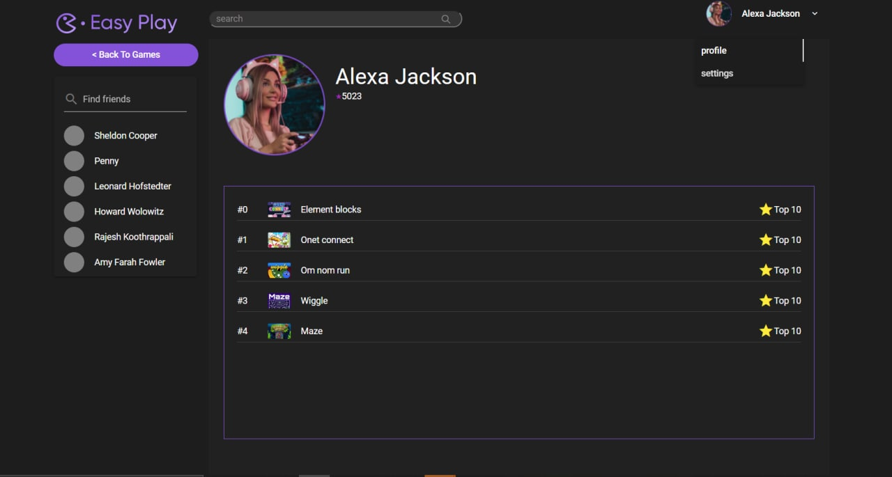
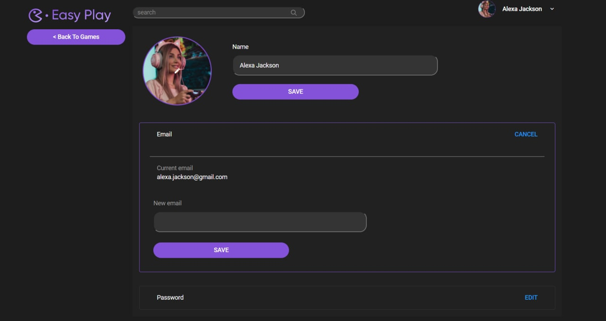

## Backend
### Yerlan Negmetulla

This week I implemented the endpoints for the Developer's dashboard. In the Developer's studio (dashboard), the developer has the ability to view the games that he/she/it has uploaded to the platform, their status, such as how many people have played a particular game during its existence, feedback left by users, and the rating of the game at the moment. It is also possible to sort the games according to different criteria. It is possible to add a game and details about it, such as titles, descriptions, covers, genres and tags for games. It is also possible to edit and delete the game. We also changed the backend folder in the project to submodule into a separate repository.

Fixed errors that occurred after the transfer of the project; Moved changes to the new repository; Changed the Game entity by bringing a user with the developer role to it; Added property for counting the number of reviews; Changed property for calculating total_rate from sum to average; For GameSerializer added options and fields for users and feedbacks; Register new router for Developer's studio (dashboard); Added DevGamesViewSet for developer studio (dashboard) and rewritten all methods for CRUD; Added sorting by different options for developers on the developer's studio page; And fixed minor errors found when viewing the project;

## Backend
### Zhanbolat Bekmaganbetov

This week i was working on game feedback system and game endpoints such game comments crud, game uploading. I started to refactor rating system, due to discussions on feedback system. It was decided to merge rating system into feedback, such as it's the same. After the game user can evaluate his game exprience and leave some comment. The comment may be empty, while the rating not. I also was working on file system and uploading file on server, at this point I tested connection with AWS S3 bucket, that provides us during the free tier 5Gb. But we are still thinking and considering about the other possible places where we could store and upload our files, we also have other options such as Yandex Object Storage and the same solution from Google Cloud and Microsoft Azure where it's also possible to store the data. This week I was also worked on the preparations for deployment and ci/cd and troubles related to restrictions on this repository (we are not able to configure ci/cd, set secrets and so one). Finally we decided to use Git submodules (info: https://git-scm.com/book/en/v2/Git-Tools-Submodules) for solving our troubles. Was created separated repository that duplicated the content of Project/backend/ folder. This main repository was syncronized with the submodule's repository. Were fixed issues related to syncronizing repositories and some small bugs were also fixed

## Frontend
### Abylay Altazhanov

This week I created some components and pages "settings", "profile", then reworked the code, fixed some bugs

Profile page:

Settings page:

# Jet Lee
* Made kung-fu
* Learned kung-fu
# Jacky Chan
* Learn kung-fu
* Invented kung-fu
