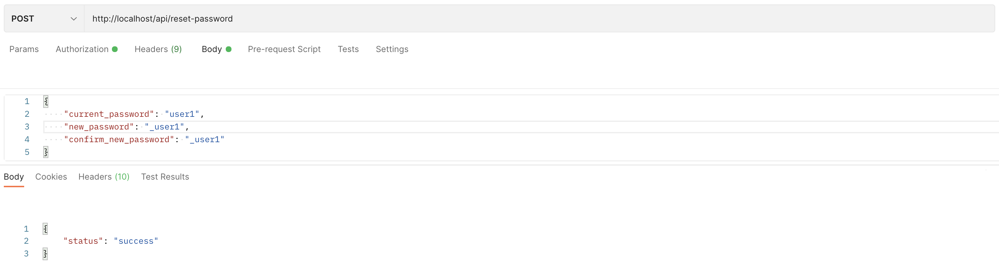
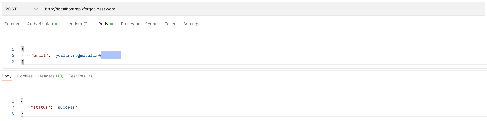
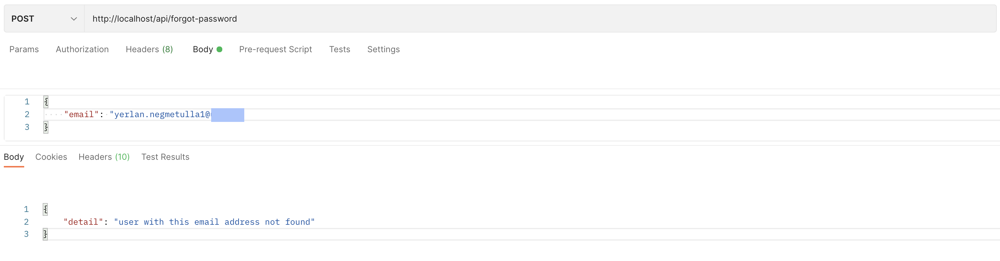
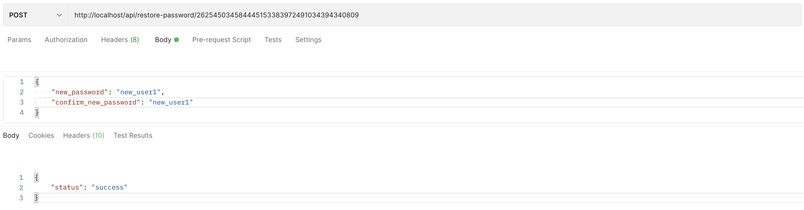

## Backend
### Yerlan Negmetulla

This week we have implemented password reset and recovery endpoints. implemented endpoints for the admin panel. And code refactoring.

When you are logged in, you can enter your old password for confirmation and change your password to a new one:

If you are not logged in and have forgotten your current password, you can recover your password using the email address you provided during registration:

Through the letter that came to your mail, you can follow the link and send a request to restore your password:

### Zhanbolat Bekmaganbetov

## Frontend
### Abylay Altazhanov
### Yernat Bekzat

This week I developed Admin's Page, where admin can accept, reject new games, and also can view game itself.

Developer's page:

Also refactored and fixed bugs in other components.

## UX/UI Design
### Aimzhan Sytdykova

The arrows that you see in the screenshot are the user's flow, in other words, a prototype so that you can clearly see the user's path, it is possible to correct the shortcomings during its construction and testing. With it, I can test on the users themselves and see the ux problems and complement the design.

In the prototype, for example, there is a path where it shows how the player gets to the game page itself, or the developer enters the studio and downloads the game developed by him.

