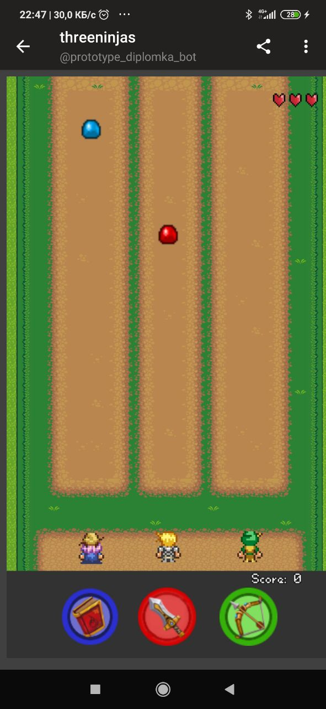

## Backend
### Yerlan Negmetulla and Zhanbolat Bekmaganbetov

This week we have been working on the development of a telegram bot that can be used to play games from our platform. The bot was written in NodeJs. For now it's just a prototype version, that we are used for testing the Telegram APIs and our system, for testing purposes we used open source HTML5 games in order to research the behavior of the bot and how it will works with games from our platform and it can be improved:

### Yerlan Negmetulla

This week we are in addition to the implementation of telegram bot, i implemented unique fields for the roles of gamers and developers. Added tags for games and search by them. And code refactoring.

When you sign up as a gamer, in addition to basic user data, you will need to select at least 3 categories for the games you like:

When you sign up as a developer, in addition to basic user data, you will need to fill in your phone contact information and a link to portfolio:

For tags, we created a table with word stem and foreign key games. For the table of games, a tag field was added where all tags with the full word will be stored. When we create a game, we save tags with a full word in the tags field of the Game table and pass each word through a stemmer in the nltk python library that pulls out the stem of the word and saves it in the TagGame table in the place with the game. We implemented it this way for the reason that when the user searches for a game by tag, they will not need to somehow mess up how to spell the word correctly, the application will search for this word by its stem word and therefore the search should be convenient and useful:

### Zhanbolat Bekmaganbetov

In addition to implementing telegram bot, i was working on code refactoring and bug fixes, i fixed bug that was related to sorting by game rating, that was caused due to lack of records in GameFeedbacks for some games, they had null value, which could not be calculated, and started to refactor existing logic of statistics gathering logic, because it didn't take into account, date when game was played and who played, then i finished uploading and loading games endpoints, added CORS support. Improved code structure in users module

https://github.com/180107180/diplom-backend/commit/dc0a62f5081c12db5711595932861c380d8cee4b
https://github.com/180107180/diplom-backend/commit/0d4810a08151aa9d0f19f02edd87552cc7e75aa5
https://github.com/180107180/diplom-backend/commit/cdfc431e7df2eba65984b5df6569306c207c8b2c

## UX/UI Design
### Aimzhan Sytdykova
This week I took a prototype of the mobile version of the application of our project, which I did last week and tried to test it. My colleagues from work helped me with this. I also decided to test it myself, as it was interesting to see what happened. Here are the links to the video:

Me - https://youtube.com/shorts/CpFoV8RFV64?feature=share \
Madi - https://youtube.com/shorts/GlPGJSo1DLY?feature=share \
Erkin - https://youtube.com/shorts/ABJR1Y-6Nrk?feature=share

## Frontend
### Yernat Bekzat
This week I've been working on connecting all features that was developed by me and by Abylay. After this I refactored code and worked on  connecting for real API, creating Models and changing state management from Vuex to a better and more friendly with typescrpit Pinia.

Some screenshots

