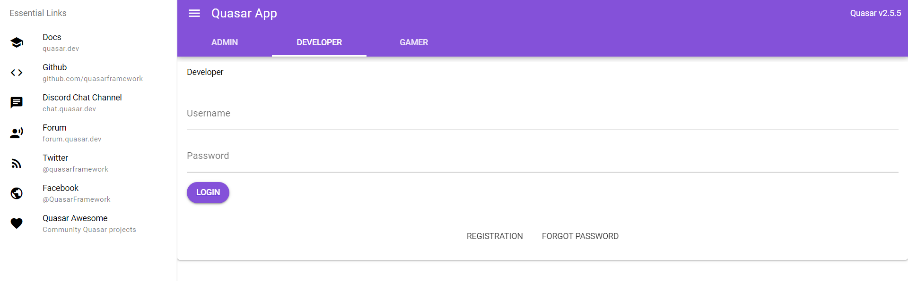
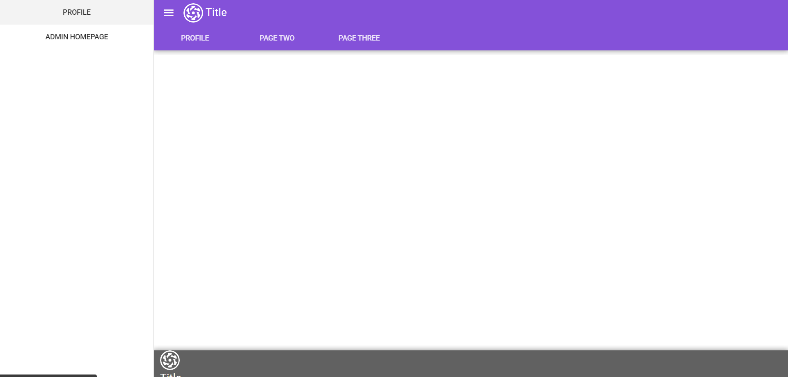

# Aimzhan Sytdykova
* Since I am responsible for UX/UI design in the project, I started with a resume and a mudboard, if you understand the area you are working on well and have an approximate vision, then the work process itself will be much easier.
Basically, I was looking at articles on user friendliness and how everything should look. For example, I found out:
Name and Nickname
People's names are their brands, so are their nicknames. Give users a chance to promote it. Not only should you introduce a 'nickname' field to this page, but you should also include the nickname in the URL. This way you will gain customers' loyalty and boost traffic to your site (especially if a famous person has an account on it). It's a good idea to allow adding both a name and a nickname. People often have the same username on multiple websites and apps, especially on those where a real name is not mandatory. Their friends who know just the nickname may search by it on your site or app to connect with the person.

* And also, I put together a mudboard. There are many interesting ones. With the help of them, I will clearly see what kind of Eton I want and be inspired by different design options.

Research

Moodboard

## Backend

We chose to use PostgreSQL as the database because it is an open source object-relational database management system that emphasizes extensibility and SQL compatibility. It exists in implementations for many UNIX-like platforms.

As the language for the backend, we chose the Django Python web framework, which promotes rapid development and clean, pragmatic design. It removes much of the hassle of web development so we can focus on writing your application without reinventing the wheel.

We decided to use nginx as a web server. nginx [engine x] - HTTP server and reverse proxy, mail proxy and general purpose TCP/UDP proxy.

Each application on our server will be placed in a docker container. Docker software for automating the deployment and management of applications in containerized environments, an application containerizer. Allows you to "package" an application with all its environments and dependencies into a container that can be deployed on any Linux system with cgroups support in the kernel, and also provides a set of commands for managing these containers.

Since we have a lot of docker containers, in order to easily manage them, we decided to use docker compose.
Docker compose is a tool for defining and running multi-container Docker applications. In Compose, we use a YAML file to set up our application's services. Then, with one command, we create and start all the services from our configuration.

## Frontend
### Yernat Bekzat
* Researched for suitable framework over VueJs framework, compared Nuxt and Quasar frameworks and decided to choose Quasar.
* Quasar offers a lot of ready tools out of the box such as Material Icons, components, layouts and layout builder, SSR and more. 

* After picking up a framework I started building base of the app, configured state management, storybook to view components in isolation and added typescript for a  typization for a safer development. This took a while, because conflicts in dependencies, but I found awesome open source solutions.

* Researched about architecture of client in web apps and come up with our own structure.

* Together with Abylai tried to deploy on Heroku and after many failures moved to Hoster.kz and deployed base app by the link
* https://www.oinap-qal.abmco.kz/#/ 
## Frontend
### Altazhanov Abylai
* configured routing for three users

* made some layouts using quasar framework

