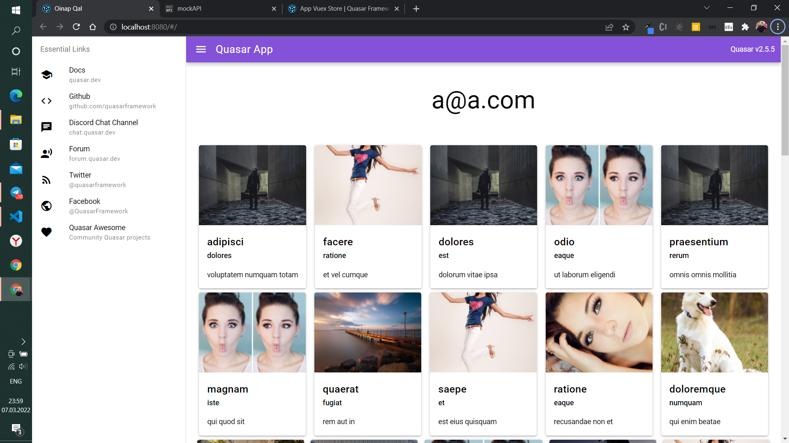
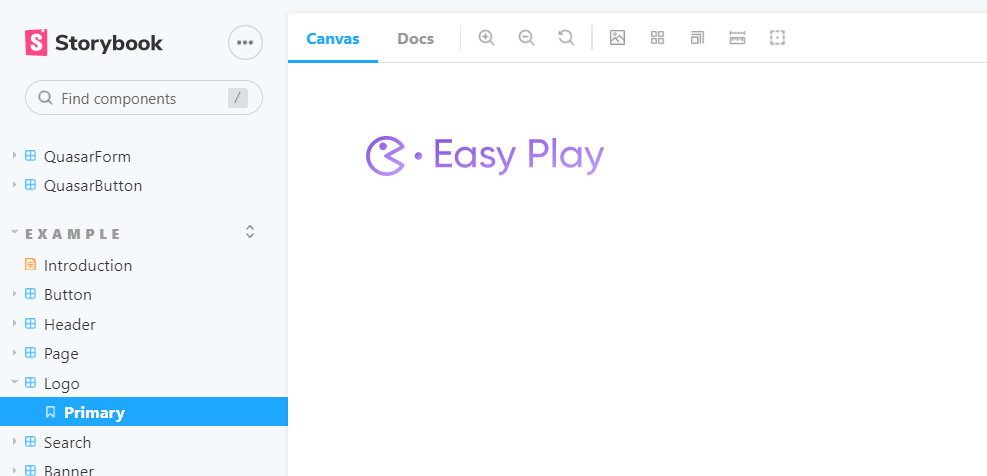
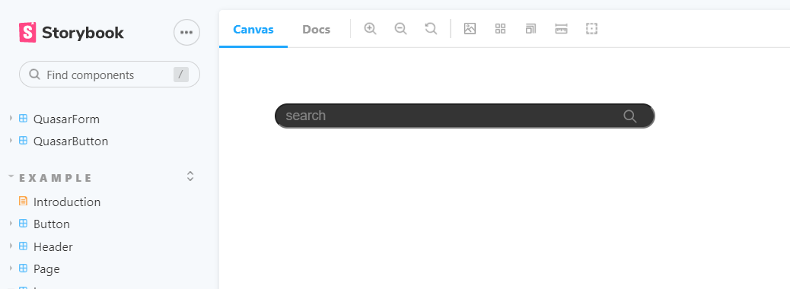
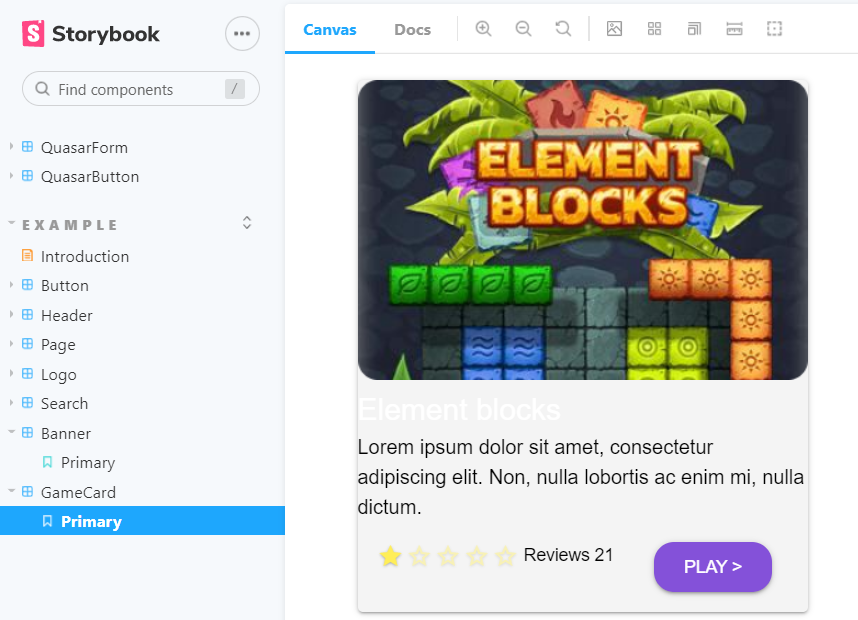
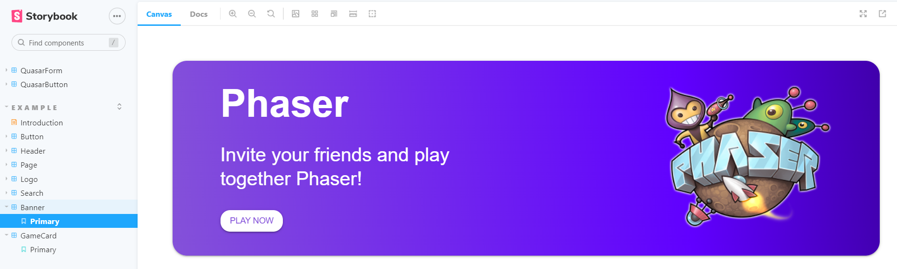

# Aimzhan Sytdykova

It was done:

* Styles. Styles simplify the work of developers themselves when designing an application. They will be able to initially add styles to their code in order not to prescribe, for example, color codes and so on in the future. I made styles not only of colors, but also fonts, effect and grid.

* Design library. I added all possible icons to the design library that can be used in the application, and also created components that can be changed in one place and then changed on other pages too, this is done so that it does not take much time to edit each component on each page.

Styles

Design library

# Backend
This week we set up django project and its configuration. We created separated dev branch for working on backend part, then configured working environment using poetry as a tool for dependency management and packaging in Python, installed all necessary dependecies( django rest framework, swagger ), configured it in django settings,  initiated and set up base modules such as Users, Authorization and Core. Branch backend-dev
https://github.com/SuleymanDemirelKazakhstan/diploma-project-graduaders/tree/backend-dev/Project/backend/diplom

## Frontend
### Yernat Bekzat
* Implemented clean architecture and tested with fake Api.
* Implemented entitities, services for making api calls.

* During development faced with a lot problem, because of poor Typescript support in Vuex.
* That's why spent a lot of time to configuring ts with vuex.

* Finally, by the end implemented base app with a clean architecture and clean code and here is result. 

* Branch frontend-dev
* https://github.com/SuleymanDemirelKazakhstan/diploma-project-graduaders/tree/layers
## Frontend
### Altazhanov Abylay

* Some components have been uploaded to the storybook.
* Logo

* Search input

* Game card

* Banner

* 