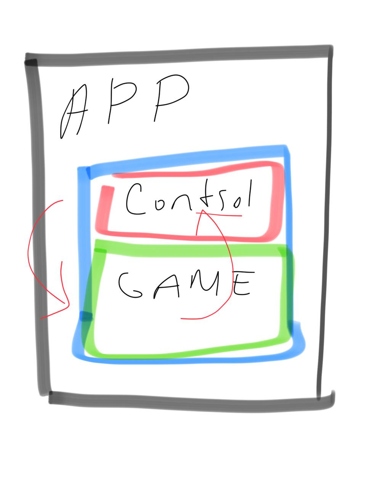

## UX/UI Design
### Aimzhan Sytdykova

**Wireframes:**\
I started creating design from wireframes. It is speeds up the work because you think over the whole structure in advance. Also it is better for developers too.

**Main/home page:**\
How you can see I completed with design of homepage which is home page where users can to return by clicking on logo. Also I created components like header, categories, "cards" of games and so on. I will help me if I want to change something in one element everywhere at a time just by changing the obscene component.

**Registration/authorization page:**\
With these page I did the same things as in the previous one like elements or components. But this page has different states like reset password or inactive buttons until the user enters all the data correctly.

## Frontend
### Yernat Bekzat
* SDK -  software development kit. In our case is a boilerplate to connect to our services and allows to integrate ads, reward for watching ads, communicate parent node to save progress, manipulate with html5 from external sources etc. 
* I researched ready solutions on the market, for example GameArt platform offers their developrs to intergrate their html5 game to pre-written boilerplate file, with all neccessary manipulations and ad integrations. Example, https://www.gamearter.com/developers/html5/packages
*  It could save a lot vulnerabilities in security and do not require extra business logic from both sides, from marketplace owners ans game developers, however we'd like to re-use our UI-library, services and in this case we should handle complex configurations to build **SDK** separately or code all UI-library again in other stack or duplicate code in to other project, which will be difficult to synchronize.
* So I come up with a 3 layered solution: APP, Control, Game. From any level I have access data through APIs. This is achieved by **Window.postMessage.**
* Here is the 3 layers: 
  
    
  
* Link to API List for SDK
    https://github.com/SuleymanDemirelKazakhstan/diploma-project-graduaders/blob/sdk-demo/Project/frontend/src/components/API%20list%20for%20SDK.md 
* Demo video of the working prototype
    https://youtu.be/WiuGbPpEut8
* here is the link to source code for SDK in **demo-sdk** branch
    https://github.com/SuleymanDemirelKazakhstan/diploma-project-graduaders/tree/sdk-demo/Project/frontend