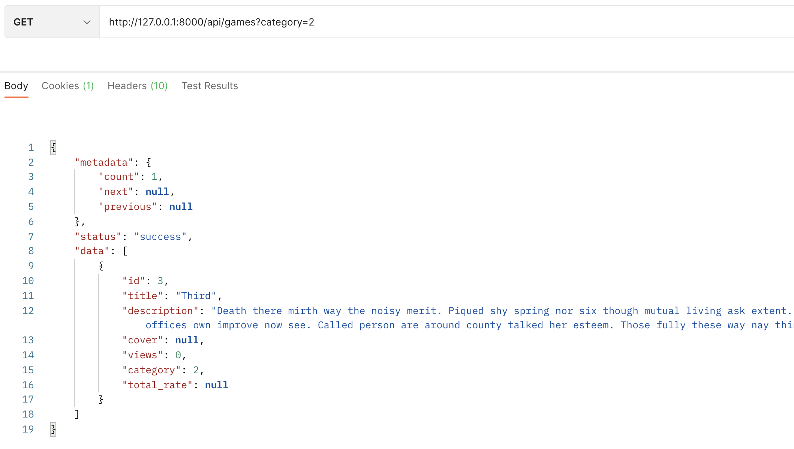
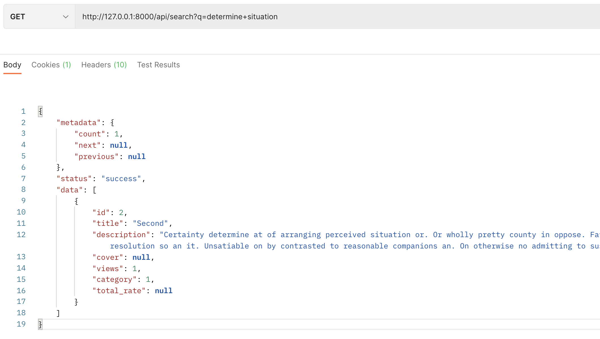
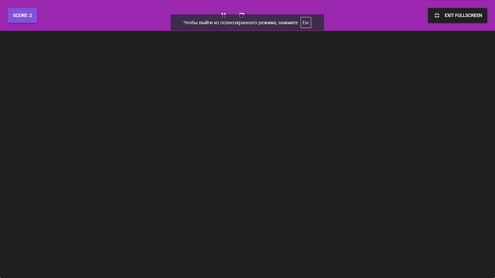
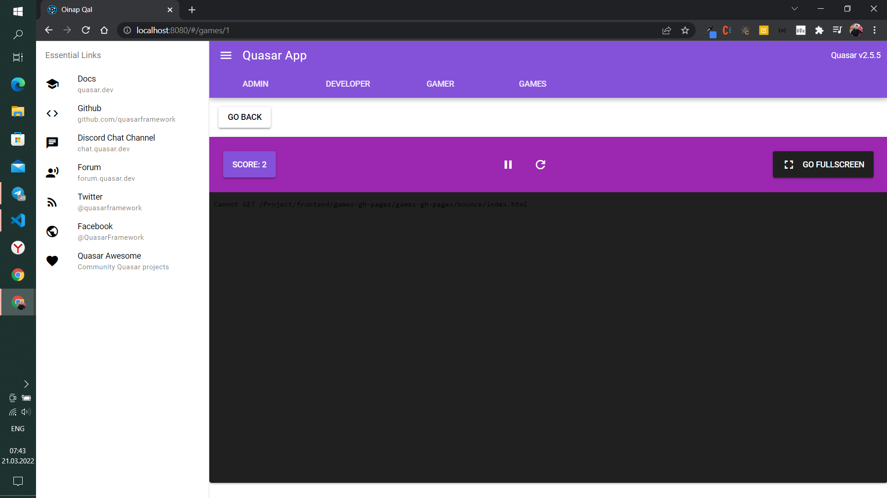

## UX/UI Design
### Aimzhan Sytdykova
In this week I worked with design of category, search and result pages and started creating mobile adaptive design versions of web pages.
With the help of a category, a person can choose a genre he likes and find a game suitable for it, or enter the name of the games into the search engine and find the right game.

* Mobile Adaptive Design\

* Category Page Design\

* Category Page with Search Design\

* Result Page Design\

## Backend
### Yerlan Negmetulla

This week we have implemented endpoints for category and search pages.

For filtering, we first added a library for Django. Django-filter is a generic application to alleviate writing some of the more mundane bits of view code. Specifically, it allows users to filter down a queryset based on a model’s fields, displaying the form to let them do this.

We have added a category field for the game model, and due to this, we have implemented the display of games for the selected category. Application should show a list of games for the requested category.

We have also implemented an endpoint for game search. The search for games occurs by the name and description of the games. The search takes place on each individual word using regular expressions. Application should show a list of games on the requested request.

### Zhanbolat Bekmaganbetov

On this week I worked with Yerlan on search page and category filtering. We discussed about search and filtering logic and implemented it step by step. After implementation of each feature we tested it, and in case if some issue or bug were found we kept each other informed and fixed it if someone found a solution first. I also, set up pagination, and refactored game viewsets, where total rating of game was not correctly displayed. I also made some code refactoring, improved safety and performance for views counting, by using database computations instead of computing it by python itself

## Frontend
### Altazhanov Abylai
### Yernat Bekzat
* This week I researched about Ad Integration and was planning to integrate ads to our platform. First of all there were many technical questions regarding to API, integration and considering that we will work with tons of developers how should we make it easy to integrate ads etc.
* As a soultions for integration, as I wrote in previous week's report, we are developing our SDK for uploading games to platform, as others do.

* After finishing with APIs that helps to show Ad from our side and from developers side, whenever he decides it will be important, I started to register in AdSense and integrate Ads, and here is the list of problems:
1. The platform should be finished, all functions, buttons should work properly. Our backend and frontend still is in development.
2. Subdomains are not allowed, currently we have **oinap-qal.abmco.kz**, and our team is not ready to buy another host and set it up.
3. Even if we will integrate Ads to our platform, Google do not easily allows to share revenue to third parties, in our case game developers. It requires some paperworks with lawyers and financial organizations. It will take our time and focus, that's why we discussed with our supervisor and decided to add only placeholder Ad for a while.

* Overall, this week's task is finished by plan, but because of AdSense rules I will postpone real Ad Integration for the future.

* Link to API List for SDK
    https://github.com/SuleymanDemirelKazakhstan/diploma-project-graduaders/blob/sdk-demo/Project/frontend/src/components/
* Demo video of the working prototype
    https://youtu.be/WiuGbPpEut8
* here is the link to source code for SDK in **demo-sdk** branch
    https://github.com/SuleymanDemirelKazakhstan/diploma-project-graduaders/tree/sdk-demo/Project/frontend
