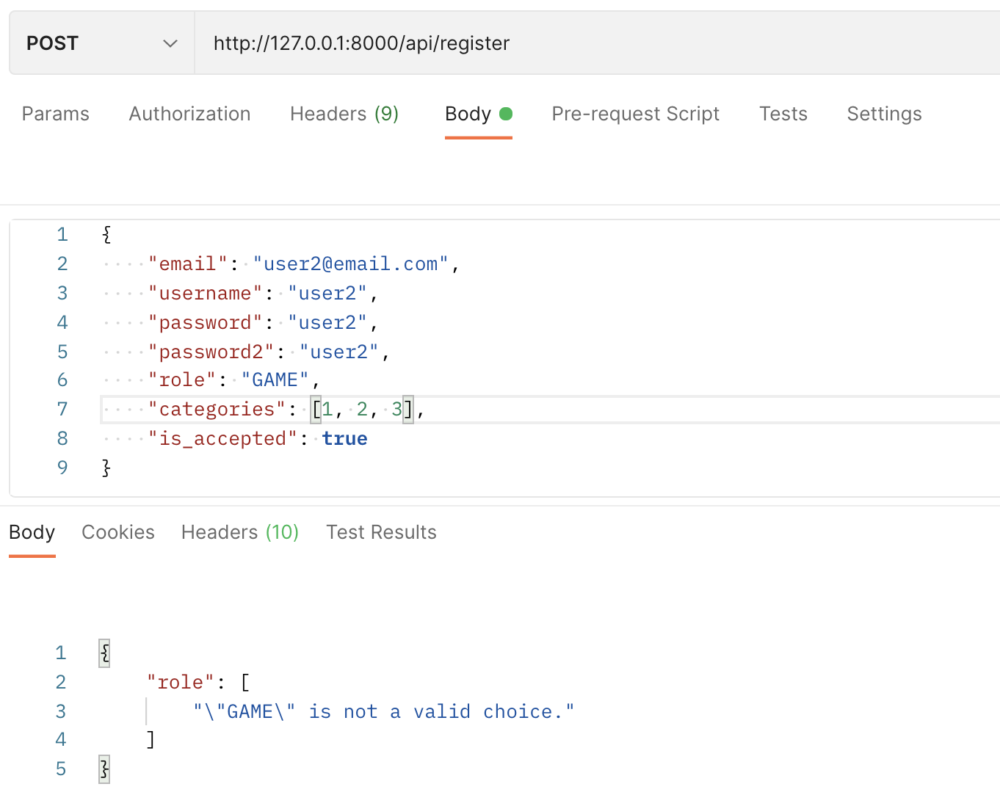
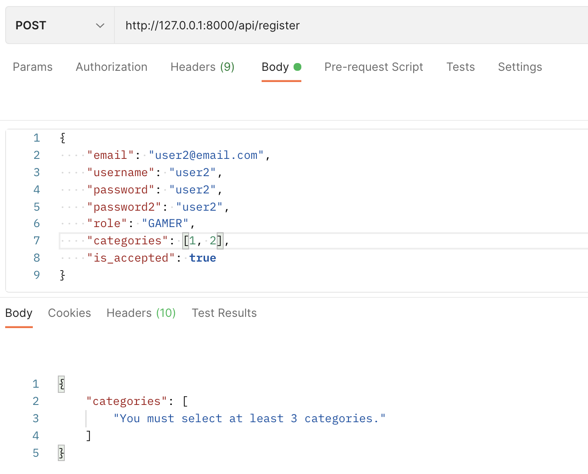
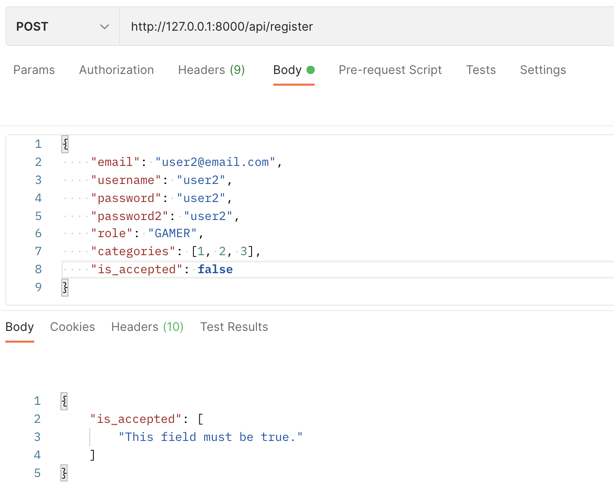
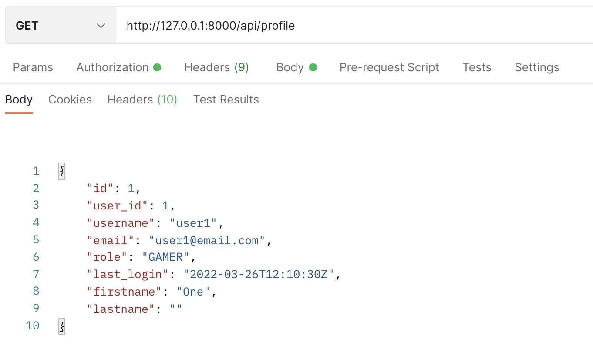

## UX/UI Design
### Aimzhan Sytdykova

This week I made two necessary pages and their states in the web and mobile versions. This is the profile and settings.

In the mobile version, as well as in the web version, I decided to make an upper side menu to go to the profile and settings from the main page. Also in this menu there is an opportunity to log out of your account. In the mobile version of the profile, the user must go to the friends and rating tab to view the information he needs, and in the web version, this information can be seen immediately when entering his page. The mobile version was made so that there was no overload of information on one page. If we talk about the settings, then everything is simple there. A person can change their email or account password by clicking on "Edit".

* Web Version
    * Upper Side Menu\
    
    * Friends and Ratings page\
    

* Mobile Version
    * Settings page
        * Change Name\
        
        * Change Email\
        
        * Change Password\
        
    * Friends and Ratings
        * Friends page\
        
        * Ratings page\
        

## Backend
### Yerlan Negmetulla

Added a UserCategory model to link the User and Category entities. And administered it in the admin panel.

Added a UserDetail model to store information about the user separately from the user entity itself. The user will have the most important information like username, email, role. All other information will be in UserDetail. This is also administered in the admin panel.

Added fields to the CustomRegisterSerializer: role for the user's role, categories for at least 3 categories that the user likes, and is_accepted to know that the user has accepted the terms of our application. And for the same fields, I added validations so that the user does not send incorrect data.

Role validation:

Сategories validation:

`is_accepted` check:

Added UserDetailSerializer for the UserDetail entity.
Implemented endpoints for User profile and settings so that users can see information about their account. Implemented endpoints so they can change information about themselves.

Part of user profile information:

### Zhanbolat Bekmaganbetov

This week I refactored code and wrote the configuration for the project, i was working on wrapping an application in docker and prepared django configuration for these purposes. I made a research on using transactions and atomic transactions in Django, async operations in python and discuss with Yerlan about business logic and it's improvement points. I also researched existed business logic in a project in order to find vulnerabilities and parts where some logic could be broken or was't took into account, such as acceptipting rules by user and discussed about it with Yerlan on the need of validation for that on out part. We also discussed about UserProfile and structure of interfaces of rest apis, as the result we decided to standartize our exception requests by creating a custom universal exception handler, which i'm working on. I with Yerlan were been spoken on the role validations for user  entities, how to handle it, what should and must be there, and what should not
